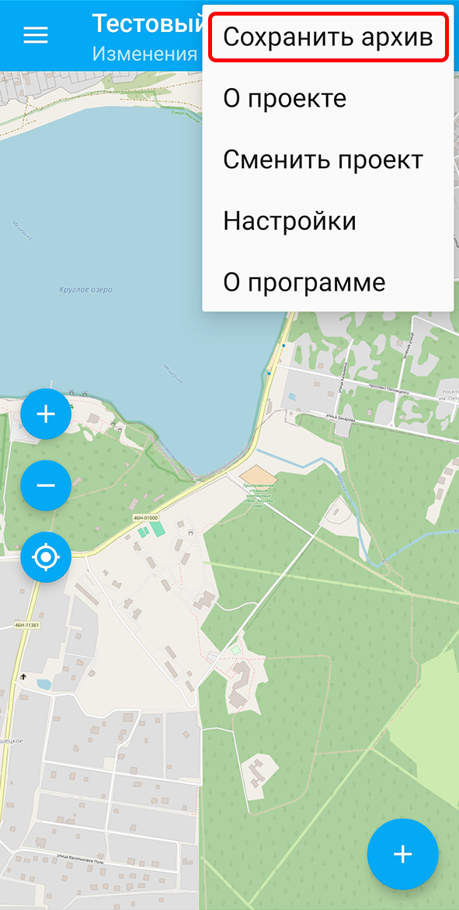
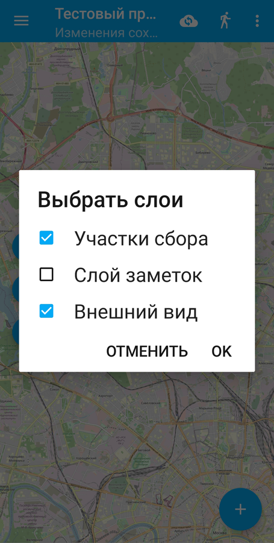
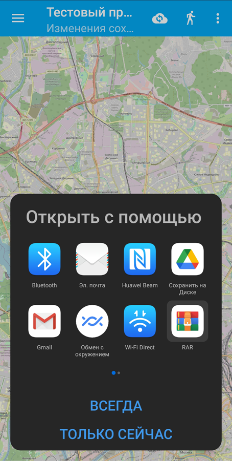
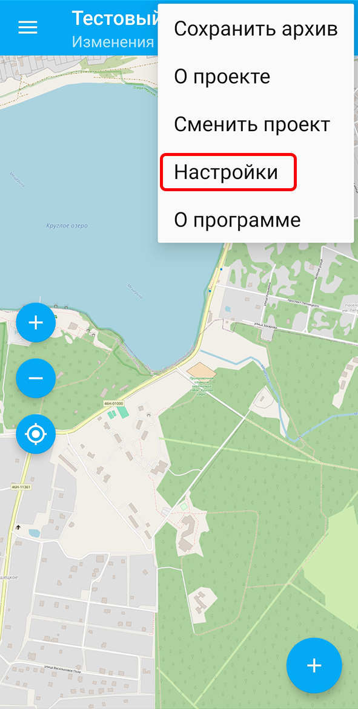
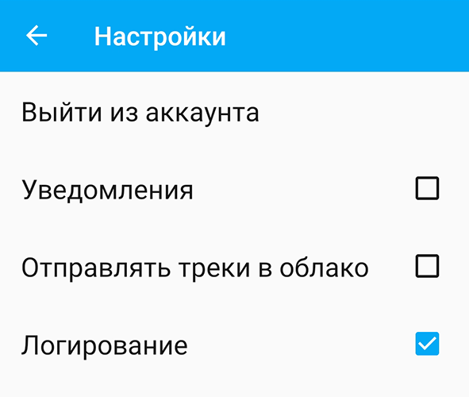
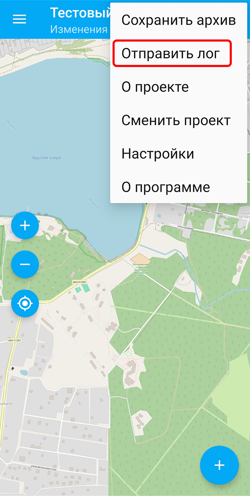

.. _adv_tools:

Вспомогательные функции
========================

.. _ngcol_backup:

Как поделиться архивом
----------------------

Приложение NextGIS Collector позволяет поделиться собранными данными в виде zip-архива. 

Нажмите три точки в правом верхнем углу и в выпадающем меню выберите «Сохранить архив».

   
   Выбор сохранения архива в меню приложения

Появится диалогове окно, в котором вы можете выбрать слои, которые хотите включить в архив.

   
   Выбор слоев для архива

Далее выберите приложение, с помощью которого вы хотите отправить архив или сохранить его в облаке или на своем устройстве.

   
   Выбор приложения для сохранения или пересылки архива

После этого устройство перенаправит вас в соответствующее приложение для завершения действия.

.. _ngcol_log:

Логирование
-----------

В приложении NextGIS Collector можно включить запись лога - технической информации о работе приложения. 

Нажмите три точки в правом верхнем углу и в выпавшем меню выберите «Настройки».

   
   Пункт "Настройки" в основном меню

В настройках поставьте галку в пункте "Логирование".

   
   Включение записи лога

Логом также можно поделиться. Для этого вызовите из верхней панели меню и нажмите «Отправить лог».

   
   Выбор действия "Отправить лог" в основном меню

Далее выберите приложение, с помощью которого вы хотите отправить лог или сохранить его в облаке или на своем устройстве.

Увидеть, как это работает, также можно в видео:

.. raw:: html

   <iframe width="560" height="315" src="https://rutube.ru/play/embed/c403797954c68d7080cc38a13669c2a8/" frameBorder="0" allow="clipboard-write; autoplay" webkitAllowFullScreen mozallowfullscreen allowFullScreen></iframe>

Смотреть на `youtube <https://youtu.be/MfWQKsDfzIY>`_, `rutube <https://rutube.ru/video/c403797954c68d7080cc38a13669c2a8/>`_.

.. _ngcol_logs_steps:

Как получить информативный лог для техподдержки
~~~~~~~~~~~~~~~~~~~~~~~~~~~~~~~~~~~~~~~~~~~~~~~~~

Логи могут помочь прояснить, что вызывает ту или иную ошибку в приложении. Чтобы лог был дал нужную информацию специалистам поддержки, сделайте следующее:

#. Включите логирование.
#. Повторите свои действия, чтобы воспроизвести проблему.
#. После того, как ошибка воспроизведена, отправьте логи в техподдержку.
#. Выключите логирование.

.. _ngcol_mock_location:

Подключение внешнего источника координат
----------------------------------------

При необходимости можно использовать стороннее приложение в качестве источника координат. 

Для этого нужно на устройстве перейти в режим разработчика, выбрать в настройках приложение подмены координат и запустить на нём симуляцию. Подробнее см. в `разделе NextGIS Mobile <https://docs.nextgis.ru/docs_ngmobile/source/mock_location.html>`_.
