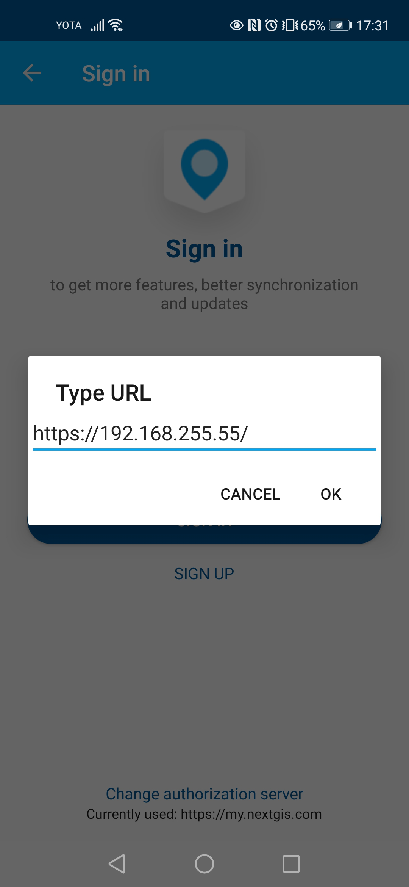

.. sectionauthor:: Roman Gainullov <roman.gainullov@nextgis.com>

.. _ngcollector_auth:

Authorization
============

Via on-premise (NGIDOP)
----------------------

For authorization in NextGIS Collector via on-premise server, you must specify the appropriate Endpoint in the authorization settings (см. :numref:`ngidop_collector_en`)

   
   Adding your own authorization server in NextGIS Collector
