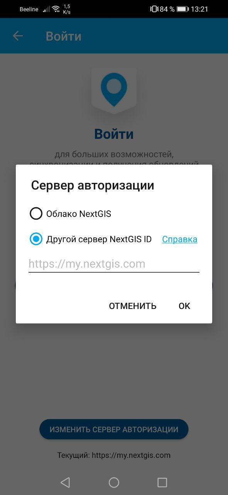

.. sectionauthor:: Роман Гайнуллов <roman.gainullov@nextgis.com>

.. _ngcollector_auth:

Авторизация
===========

Через облачный сервер (my.nextgis.com)
--------------------------------------

Для пользователей по подписке авторизация в приложении NextGIS Collector осуществляется через сервер https://my.nextgis.com/ по умолчанию.
В качестве логина и пароля используется почта и пароль от облачного NextGIS ID пользователя.

Через собственный сервер (NGIDOP)
---------------------------------

Для авторизации в NextGIS Collector через локальный сервер необходимо указать соответствующий Endpoint в настройках авторизации при входе в приложение (см. :numref:`ngidop_collector`). Если вы перед этим уже вошли через my.nextgis.com - необходимо сначала выйти.

   
   Добавление собственного сервера авторизации в NextGIS Collector

Авторизация пользователей on-premise происходит через раздел `"Команда" <https://docs.nextgis.ru/docs_ngid/source/ngidop.html#ngidop-teams>`_ в настройках NextGIS ID on-premise.
Администратор предварительно создает в нем пользователей, которые планируют осуществлять сбор данных.
