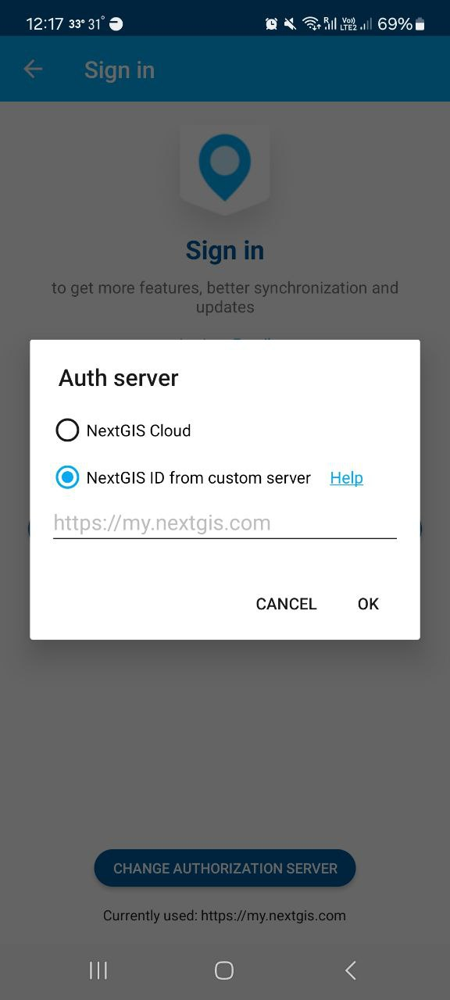

.. sectionauthor:: Roman Gainullov <roman.gainullov@nextgis.com>

.. _ngcollector_auth:

Authorization
==============

Via cloud server (my.nextgis.com)
-----------------------------------

For subscribed users, authorization in the NextGIS Collector application is carried out via https://my.nextgis.com/ server by default.
The email and password from the cloud NextGIS ID are used as a login and password for app.

Via on-premise (NGIDOP)
----------------------

For authorization in NextGIS Collector via on-premise server, you must specify the appropriate Endpoint in the authorization settings (см. :numref:`ngidop_collector`).  If you're already logged in with my.nextgis.com - log out first.

   
   Adding your own authorization server in NextGIS Collector
