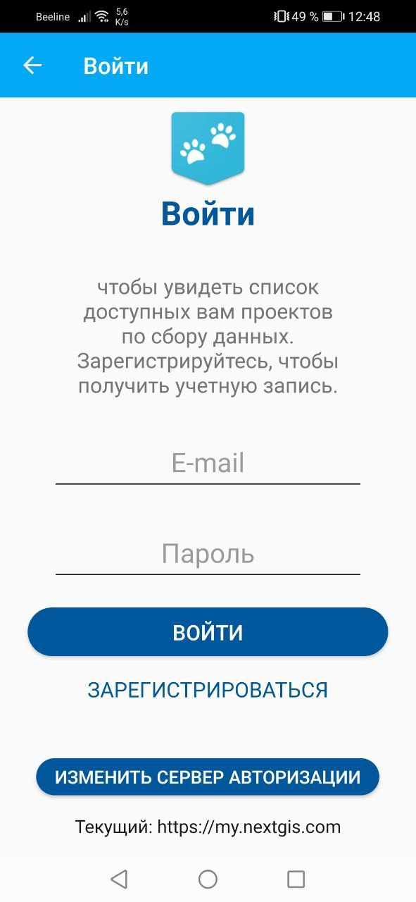
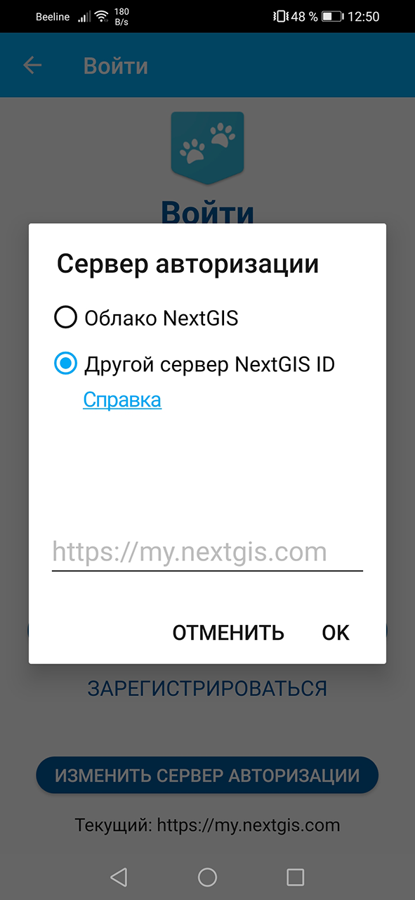
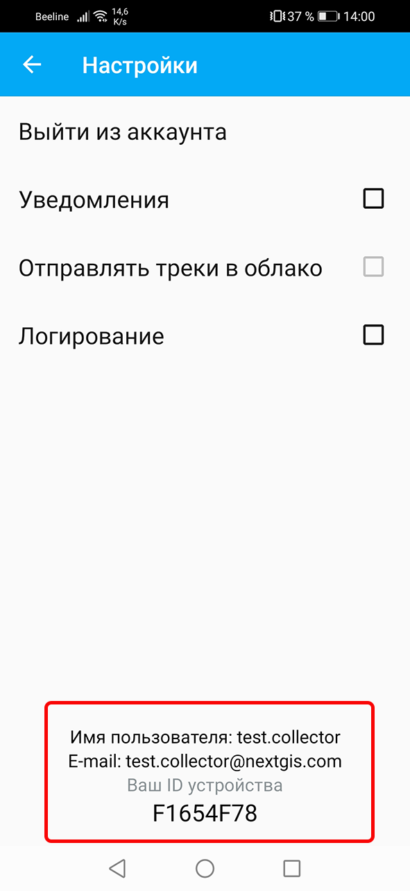

.. _ngcollector_auth:

Авторизация
===========

Через облачный сервер (my.nextgis.com)
--------------------------------------

Авторизация в приложении NextGIS Collector осуществляется через сервер https://my.nextgis.com/.
В качестве логина и пароля используется почта и пароль от личного кабинета пользователя NextGIS ID.

   Экран авторизации

Через собственный сервер (NGIDOP)
---------------------------------

Для авторизации в NextGIS Collector через локальный сервер необходимо сменить сервер авторизации при входе в приложение (см. :numref:`ngidop_collector`). Если вы перед этим уже вошли через my.nextgis.com - необходимо сначала выйти.

   
   Добавление собственного сервера авторизации в NextGIS Collector

Управление пользователями происходит через раздел `"Команда" <https://docs.nextgis.ru/docs_ngid/source/ngidop.html#ngidop-teams>`_ в настройках NextGIS ID on-premise.
Администратор предварительно создаёт в нем пользователей, которые будут осуществлять сбор данных.

.. _ngcollector_auth_change:

Сменить пользователя
------------------------

Посмотреть, под какой учётной записью вы авторизованы в данный момент, можно в меню "Настройки". Внизу страницы вы увидите адрес электронной почты, а также ID устройства.

   Сведения об авторизованном пользователе в настройках NextGIS Collector

Чтобы войти под другой учётной записью, нажмите "Выйти из аккаунта" и затем авторизуйтесь, как описано выше.
