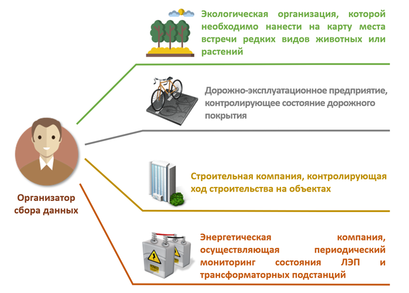

.. _intro:

.. _nextgis.com: http://nextgis.com/
.. _NextGIS Collector: https://play.google.com/store/apps/details?id=com.nextgis.collector

Введение
========

Сбор пространственных данных необходим для того, чтобы получить географическую и атрибутивную информацию об объектах,
расположенных на местности. Географическая составляющая описывается координатами. Атрибутивная информация - это
описание характеристик (свойств) объекта.

.. note::
    В качестве **примера** можно привести задачу мониторинга за состоянием объектов дорожной инфраструктуры.
    Дорожно-эксплуатационное предприятие должно осуществлять периодический контроль за состоянием дорожного полотна.
    Соответсвенно объектами для сбора пространственных данных в данном случае выступят повреждения дорожного покрытия.
    Географическая составляющая информации - координаты местоположения таких повреждений. Атрибутивная информация - это
    тип повреждения, его размеры, описание расположения в границах дорожного полотна, фотография повреждения. Для того,
    чтобы упростить процедуру сбора такой информации и предоставить инструмент для сбора таких данных и была разработана
    система NextGIS Collector.

Однако, прежде чем перейти к техническому описанию возможностей системы необходимо рассмотреть основных участников
процесса сбора данных для лучшего понимания принципов работы системы.

В процессе сбора пространственных данных можно выделить две роли:

* Организатор сбора данных.
* Участник сбора данных.

   Абстрактные роли, выделяемые в процессе сбора данных

В роли *организатора сбора данных* выступает субъект, который организует процесс сбора данных, собирает команду
участников, контролирует процесс и верифицирует полученные данные. В этой роли может выступать как группа людей, так
и отдельный человек. В примере, который был приведен выше, в роли организатора сбора данных выступало
дорожно-эксплуатационное предприятие.

Ниже, приведены примеры организаторов сбора данных и задач, которые у них возникают.

   Примеры  организаторов сбора данных

В роли *участника сбора данных* выступает человек, который осуществляет сбор данных на местности. В его задачи входит
описание свойств реального объекта на местности. До активного распространения мобильных устройств сбор данных
осуществлялся с помощью блокнота и письменных принадлежностей. Сегодня мобильные устройства помогают существенно
упростить этот процесс и уменьшить количество ошибок, поэтому предполагается, что каждый участник сбора данных
обеспечен мобильным устройством.
