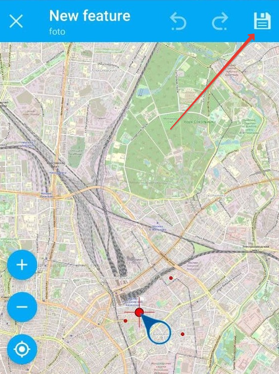
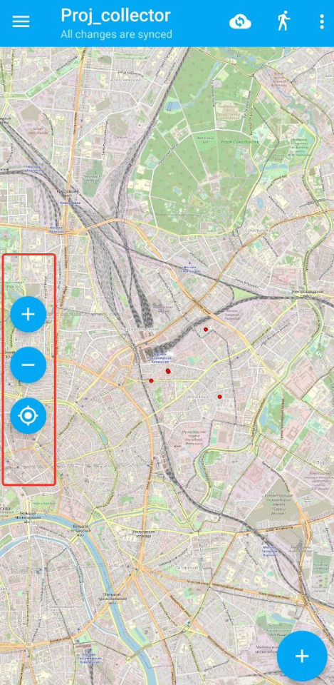
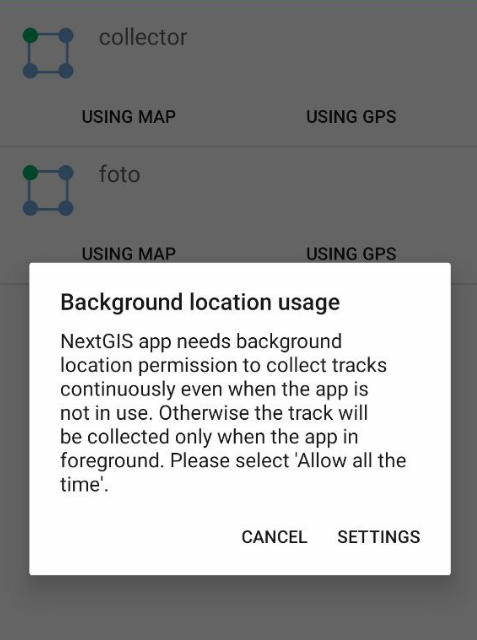

.. sectionauthor:: Роман Гайнуллов <roman.gainullov@nextgis.com>

.. _ngcol_tools:

Основные операции
==================

В этом разделе педставлен перечень основных функций, доступных сборщику даннных в мобильном приложении NextGIS Collector.
На данном этапе пользователь уже прошел авторизацию в приложении и выбрал настроенный администратором проект для сбора данных.

.. _ngcol_create_point:

Добавить точку
--------------

Добавить точку в приложении можно двумя способами:

1. Указать её на карте (с помощью подложки, снимка и т.д.)
2. Используя координаты GPS устройства

.. figure:: _static/ngcol_add_point.png
   :name: ngcol_add_point
   :align: center
   :height: 10cm
 
   Иконка добавления точки
  

.. figure:: _static/ngcol_map_gps.png
   :name: ngcol_map_gps
   :align: center
   :height: 10cm
 
   Способы добавления точки

.. figure:: _static/ngcol_attr_gps.png
   :name: ngcol_attr_gps
   :align: center
   :height: 10cm
 
   Добавление точки по GPS

Когда точка поставлена, указывается атрибутивная информация, при необходимости добавляются фотографии.
Подтверждение добавления точки происходит нажатием "галки" на верхней панели
(для карты -  сначала следует сохранить местоположение точки "дискетой" в той же панели, после чего откроется атрибутивная информация).

.. figure:: _static/ngcol_add_photo.png
   :name: ngcol_add_photo
   :align: center
   :height: 10cm
 
   Прикрепление фотографии. Можно выбрать как из памяти устройства, так и сделать новую в приложении

 
   Иконка "дискета" - сохранение местоположения точки

.. _ngcol_modify_point:

Отредактировать точку на карте
------------------------------

Операция редактирования предполагает изменение:

1. Местоположения точки
2. И её атрибутов/вложений

Для редактирования точки нужно:

1. Выбрать её кликом на карте. Откроется панель инструментов в правой части экрана. Верхний - изменение местоположения, нижний - изменение атрибутивной информации. 

.. figure:: _static/ngcol_edit_pont.png
   :name: ngcol_edit_pont
   :align: 10cm
 
   Инструменты редактирования местоположения и атрибутов точки

2. При необходимости изменить местоположение точки. Для этого есть 3 способа:

- Переместить курсор на карте;
- Воспользоваться панелью в нижней части экрана - автоматически выставить курсор либо по центру карты, либо вашему текущему местоположению.

.. figure:: _static/ngcol_edit_location.png
   :name: ngcol_edit_location
   :align: center
   :height: 10cm
 
   Инструменты "по центру карты" и "по текущему местоположению"

3. При необходимости отредактировать атрибутивную информацию и вложения.

.. _ngcol_scale:

Масштаб и текущее местоположение
--------------------------------

Сборщик данных имеет возможность управлять текущим масштабом карты.
Для этого в левой части карты находятся кнопки приближения и отдаления (+/-).
В этом же блоке можно выставить охват карты по текущему местопооложению устройства.

 
   Инструменты "по центру карты" и "по текущему местоположению"

.. _ngcol_tracks:

Треки
------

Приложение NextGIS Collector позволяет записывать треки. Иконка управления треками находится на верхней панели.

.. figure:: _static/ngcol_track_icon.png
   :name: ngcol_track_icon
   :align: center
   :height: 5cm
 
   Иконка "Треки"

 
   Начало записи трека/список треков

Для этого приложению в настройках устройства необходимо дать разрешение на запись данных в фоновом режиме.

 
   Уведомление о запросе использования геолокации в фоновом режиме

   
   Разрешить использование местоположения в любом (в том числе фоновом) режиме

Записанные пользователем треки можно показать/скрыть, изменить цифровую палитру, экспортировать или удалить.

.. figure:: _static/ngcol_track_list.png
   :name: ngcol_track_list
   :align: center
   :height: 5cm
 
   Список записанных треков 

.. _ngcol_sync:

Синхронизация
--------------

Для принудительной синхронизации данных с Веб ГИС сборщик может воспользоваться иконкой на верхней панели

.. figure:: _static/ngcol_sync.png
   :name: ngcol_sync
   :align: center
   :height: 5cm
 
   Синхронизация
