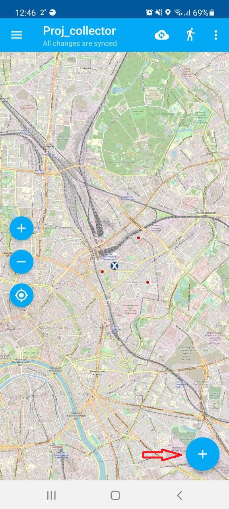
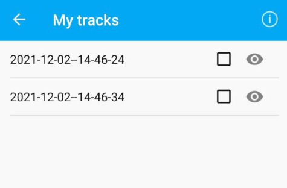

.. sectionauthor:: Роман Гайнуллов <roman.gainullov@nextgis.com>

.. _ngcol_tools:

Основные операции
==================

В этом разделе педставлен перечень основных функций, доступных сборщику даннных в мобильном приложении NextGIS Collector.
На данном этапе пользователь уже прошел авторизацию в приложении и выбрал настроенный администратором проект для сбора данных.

.. _ngcol_create_point:

Добавить точку
--------------

Добавить точку в приложении можно двумя способами:

1. Указать её на карте (с помощью подложки, снимка и т.д.)
2. Используя координаты GPS устройства

 
   Иконка добавления элемента
  

.. figure:: _static/ngcol_map_gps.png
   :name: ngcol_map_gps
   :align: center
   :width: 10cm
 
   Способы добавления точки

Для добавления точки **на карте** укажите её расположение при помощи курсора. Вы можете автоматически переместить курсор в центр экрана или в текущее местоположение устройства при помощи инструментов внизу экрана. Затем нажмите на иконку "дискеты" в правом верхнем углу, чтобы сохранить расположение точки.

.. figure:: _static/ngcol_save_location.png
   :name: ngcol_save_location
   :align: center
   :width: 10cm
 
   Иконка "дискета" - сохранение местоположения точки
   
На следующем экране указывается атрибутивная информация, при необходимости добавляются фотографии.
Подтверждение добавления точки происходит нажатием "галки" на верхней панели.

.. figure:: _static/ngcol_add_photo.png
   :name: ngcol_add_photo
   :align: center
   :width: 10cm
 
   Прикрепление фотографии. Можно выбрать как из памяти устройства, так и сделать новую в приложении

При добавлении точки **по GPS** вы сразу будете перенаправлены на экран ввода атрибутов.

.. figure:: _static/ngcol_attr_gps.png
   :name: ngcol_attr_gps
   :align: center
   :width: 10cm
 
   Добавление точки по GPS

.. _ngcol_modify_point:

Отредактировать точку на карте
------------------------------

Операция редактирования предполагает изменение:

1. Местоположения точки
2. Её атрибутов/вложений

Для редактирования точки нужно:

1. Выбрать её кликом на карте. Откроется панель инструментов в правой части экрана. Верхний - изменение местоположения, нижний - изменение атрибутивной информации. 

 
   Инструменты редактирования местоположения и атрибутов точки

2. При необходимости изменить местоположение точки. Для этого есть 3 способа:

- Переместить курсор на карте;
- Воспользоваться панелью в нижней части экрана - автоматически выставить курсор либо по центру карты, либо вашему текущему местоположению.

 
   Инструменты "по центру карты" и "по текущему местоположению"

3. При необходимости отредактировать атрибутивную информацию и вложения.

4. Сохранить внесенные изменения, нажав на иконку "дискеты".

.. _ngcol_create_point:

Добавить полигон
----------------

Для того, чтобы добавить полигон на один из слоев проекта, нужно перейти к карте и нажать на иконку "+", а затем выбрать слой, содержащий полигоны.

 
   Иконка добавления точки

Затем нужно выбрать слой, на который будет добавлен полигон, и способ его добавления - на карте или по gps.

   
   Выбор слоя и способа добавления полигона

После этого снова откроется карта, на которой будет добавлен треугольник с курсором в левом верхнем углу. 

   
   Шаблон полигона

Для того, чтобы придать полигону необходимую форму, выберите курсором вершину и перетяните её в нужное место.

   
   Изменение формы полигона

Чтобы сохранить новый полигон, нажмите на иконку с дискетой в правом верхнем углу.

.. figure:: _static/ngcol_polygon_save_ru.png
   :name: ngcol_polygon_save_pic
   :align: center
   :width: 10cm
   
   Иконка сохранения полигона

В следующем окне введите необходимую аттрибутивную информацию и нажмите галочку в верхней панели для завершения сохранения.

   
   Завершение сохранения

Созданный полигон будет отображаться в приложении и на веб-карте в Веб ГИС, если на неё добавлен соответствующий слой.

   
   Созданный полигон на карте в приложении NextGIS Collector
   

   
   Созданный полигон на карте в Веб ГИС

..:note:

   Следите за тем, чтобы слой подложки не был расположен выше слоя, на который добавляются полигоны, и не загораживал их.

.. _ngcol_modify_polygon:

Редактирование полигона
-----------------------

Для того, чтобы отредактировать полигон, нажмите на него. Вокруг полигона появится голубая рамка, а справа - две иконки редактирования. 

* Верхняя - редактирование формы полигона (выберите курсором вершину и перетащите её на нужное место).
* Нижняя - редактирование аттрибутивной информации.

   
   Редактирование полигона

.. _ngcol_scale:

Масштаб и текущее местоположение
--------------------------------

Сборщик данных имеет возможность управлять текущим масштабом карты.
Для этого в левой части карты находятся кнопки приближения и отдаления (+/-).
В этом же блоке можно выставить охват карты по текущему местопооложению устройства.

.. figure:: _static/ngcol_scale.png
   :name: ngcol_scale
   :align: center
   :width: 10cm
 
   Инструменты управления масштабом и текущим местоположением

.. _ngcol_tracks:

Треки
------

Приложение NextGIS Collector позволяет записывать треки. Иконка управления треками находится на верхней панели.

.. figure:: _static/ngcol_track_icon.png
   :name: ngcol_track_icon
   :align: center
   :width: 10cm
 
   Иконка "Треки"

.. figure:: _static/ngcol_start_track.png
   :name: ngcol_start_track
   :align: center
   :width: 10cm
 
   Начало записи трека/список треков

Для этого приложению в настройках устройства необходимо дать разрешение на запись данных в фоновом режиме.

.. figure:: _static/ngcol_permissions1.png
   :name: ngcol_permissions1
   :align: center
   :width: 10cm
 
   Уведомление о запросе использования геолокации в фоновом режиме

.. figure:: _static/ngcol_permissons2.png
   :name: ngcol_permissons2
   :align: center
   :width: 10cm
   
   Разрешить использование местоположения в любом (в том числе фоновом) режиме

Записанные пользователем треки можно показать/скрыть, изменить цифровую палитру, экспортировать или удалить.

 
   Список записанных треков 

.. _ngcol_sync:

Синхронизация
--------------

Для принудительной синхронизации данных с Веб ГИС сборщик может воспользоваться иконкой на верхней панели.

.. figure:: _static/ngcol_sync.png
   :name: ngcol_sync
   :align: center
   :width: 10cm
 
   Синхронизация
