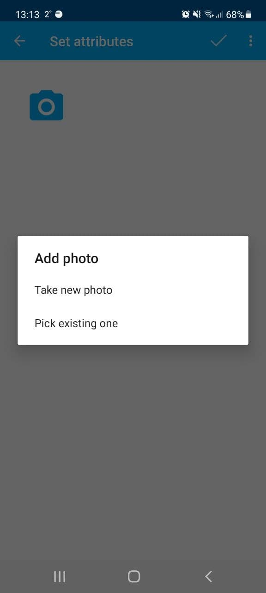

.. sectionauthor:: Roman Gainullov <roman.gainullov@nextgis.com>

.. _ngcol_tools:

Basic operations
==================

This section contains a list of the main functions available to the data collector in the NextGIS Collector mobile application.
At this stage, the user has already passed auth in the application and selected a project configured by administrator for data collection.

.. _ngcol_create_point:

Add a point
-----------

There are two ways to add a point in the application:

1. Mark it on the map (using a basemap, raster image, etc.)
2. Using the device's GPS coordinates

.. figure:: _static/ngcol_add_point.png
   :name: ngcol_add_point
   :align: center
   :height: 10cm
 
   Add point icon
  

.. figure:: _static/ngcol_map_gps.png
   :name: ngcol_map_gps
   :align: center
   :height: 10cm
 
   Ways to add a point

 
   Adding a point by GPS

After marking a point you can also set an attributive info and, if necessary, attach photos.
Confirmation of adding a point is done by clicking on the checkmark on the top panel
(for a map - first, you should save the location of the point with a "Floppy disk" icon in the same panel, after which the attribute information will open).

 
   Attaching a photo. You can select both from the device memory and make a new one in the application

.. figure:: _static/ngcol_save_location.png
   :name: ngcol_save_location
   :align: center
   :height: 20cm
 
   Floppy disk icon - save the location of the point

