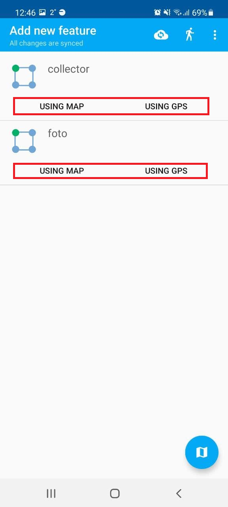
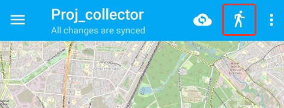
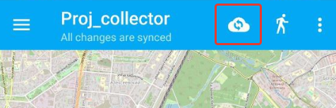

.. sectionauthor:: Roman Gainullov <roman.gainullov@nextgis.com>

.. _ngcol_tools:

Basic operations
==================

This section contains a list of the main functions available to the data collector in the NextGIS Collector mobile application.
At this stage, the user has already passed auth in the application and selected a project configured by administrator for data collection.

.. _ngcol_create_point:

Add a point
-----------

There are two ways to add a point in the application:

1. Mark it on the map (using a basemap, raster image, etc.)
2. Using the device's GPS coordinates

 
   Add item icon
  

 
   Ways to add a point

To add a point **using the map** you need to indicate its location with the cursor. You can move the cursor automatically to the center of the screen (red cross) or your current location (blue circle) using the buttons in the bottom panel.
After marking the point press the floppy disk icon in the top right corner to save.

 
   Floppy disk icon - save the location of the point

On the next screen you need to set attributive info and, if necessary, attach photos.
Then confirm adding a point by clicking on the checkmark on the top panel.

.. figure:: _static/ngcol_add_photo.png
   :name: ngcol_add_photo
   :align: center
   :width: 10cm
 
   Attaching a photo. You can select from the device memory or make a new one in the application

   
   Entering attributes and completing the creation

If you choose to add a point **by GPS**, you will be redirected straight to the attribute screen. Add attribute information and tap the tick in the top panel to save the new point.

.. figure:: _static/ngcol_attr_gps.png
   :name: ngcol_attr_gps
   :align: center
   :width: 10cm
 
   Adding a point by GPS
   
   
.. _ngcol_modify_point:

Edit a point on the map
------------------------

The app allows changing:

1. Point locations
2. Point's attributes / attachments

To edit a point:

1. Select a point by clicking on the map. The toolbar will open on the right side of the screen.

* Upper - change location, 
* lower - change attributes.

 
   Point location and Attribute editing tools

2. Change the location of the point as needed. There are 3 ways to do this:

- Move the cursor on the map;
- Use the panel at the bottom of the screen - automatically position the cursor either in the center of the map, or your current location.

 
   Center map and current location tools

3. Edit attribute information and attachments as needed.
4. Press floppy disc icon to save changes.

.. _ngcol_create_point:

Add a polygon
----------------

To add a polygon to one of the layers, first open the map and tap the plus icon. Then select a layer containing polygons.

 
   "Add item" icon

Select the layer to add a polygon to and the way to use for its creation - using map or GPS.

   
   Selecting layer and way of adding a polygon

You will be redirected to the map again. A triangle will appear with a cursor at its top left corner. 

   
   Polygon template

To modify the shape of the polygon select one apex at a time with the cursor and drag it to the desired location.

   
   Modifying the shape of the polygon

To safe the new polygon, press the floppy disk icon in the top right corner.

   
   "Save" icon

In the next screen enter the necessary attributes and tap the tick in the top panel to complete creating the polygon.

   
   Completing the creation

Newly created polygon will be visible in the app and on a Web Map in the Web GIS that has this layer added.

   
   Newly created polygon on the map in the NextGIS Collector app
   

   
   Newly created polygon on a map in Web GIS

..:note:

   Make sure the basemap is below the polygon layer and does not obscure it.

.. _ngcol_modify_polygon:

Editing polygons
-----------------------

To modify a polygon, tap it. It will be outlined in blue and two icons will appear to the right. 

* Upper one - editing the shape of the polygon (select an apex with the cursor and drag it).
* Lower one - editing the attributes.

   
   Editing a polygon

.. _ngcol_scale:

Zoom and current location
--------------------------

The data collector has the ability to control the current scale of the map.
To do this, on the left side of the map there are items for zooming in and out (+/-).
In the same block, you can set the map extent by the current location of the device.

.. figure:: _static/ngcol_scale_en.png
   :name: ngcol_scale
   :align: center
   :height: 20cm
 
   Zoom and current location controls

.. _ngcol_tracks:

Tracks
------

NextGIS Collector allows you to record tracks. The track control icon is on the top panel.

 
   Tracks icon

.. figure:: _static/ngcol_start_track.png
   :name: ngcol_start_track
   :align: center
   :height: 10cm
 
   Starting track recording/track list

To do this, the app must be given permission to write data in the background in the device settings.

.. figure:: _static/ngcol_permissions1.png
   :name: ngcol_permissions1
   :align: center
   :height: 10cm
 
   Background geolocation request

.. figure:: _static/ngcol_permissons2.png
   :name: ngcol_permissons2
   :align: center
   :height: 10cm
   
   Allow location to be used in any (including background) mode

User-recorded tracks can be shown / hidden, changed digital palette, exported or deleted.

.. figure:: _static/ngcol_track_list.png
   :name: ngcol_track_list
   :align: center
   :height: 5cm
 
   Recorded track list
   
   
.. _ngcol_sync:

Synchronization
----------------

To force synchronization of data with Web GIS, you can use the icon on the top panel.

 
   Synchronization
