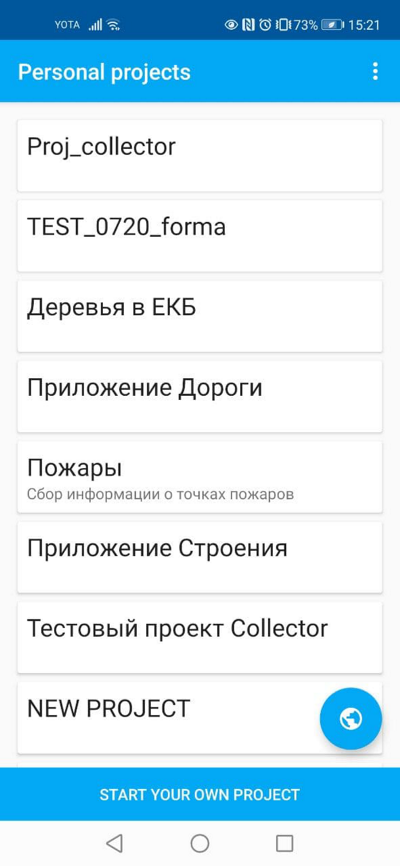
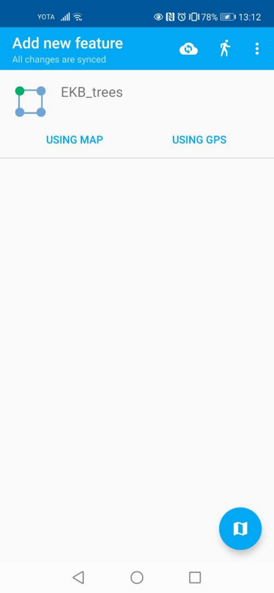
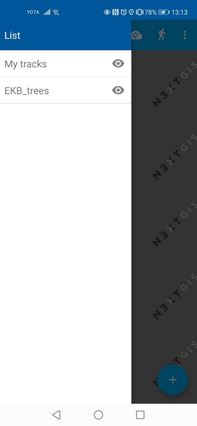

.. sectionauthor:: Roman Gainullov <roman.gainullov@nextgis.com>

.. _ngcol_oper:

Working with projects
=====================

After a successful login, team member data collection will see a list of projects.
Suppose that a data collection project was created in Web GIS with a start page setting in the form of a list.
If you choose this test project NextGIS Collector mobile application displays a list of layers.
You can also switch to map mode.

   Select a project to collect

   Editable project layers

   List of Project Layers in Map View

Member data collection team can start editing layers. Editing tools
and approaches are similar to those used in NextGIS Mobile.
