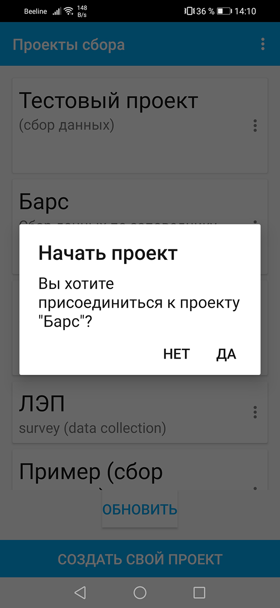

.. _ngcol_oper:

Работа с проектами
==================

.. note::
    Подробный алгоритм организации сбора данных описан в `данном <https://docs.nextgis.ru/docs_ngcom/source/collector.html>`_ разделе.

После успешного входа участник команды по сбору данных увидит список доступных проектов. Чтобы увидеть более подробную информацию о проекте, нажмите на три точки справа. Во всплывающем окне будет номер версии проекта и ссылка на размещение проекта в Веб ГИС.

.. figure:: _static/project_info_ru.png
   :name: project_info_pic
   :align: center
   :width: 8cm

   Информация о проекте

Чтобы присоединиться к проекту, нажмите на него и затем подтвердите это действие во всплывающем окне.

   Выберите проект для сбора

Начальной страницей проекта может быть карта или список слоёв. 

.. figure:: _static/ngc_layer_list_ru.png
   :name: ngc_layer_list_pic
   :align: center
   :width: 8cm

   Редактируемые слои проекта

Чтобы переключиться в режим карты, нажмите иконку |button_map| в правом нижнем углу.

.. |button_map| image:: _static/button_map.png
   :width: 8mm

На карте чтобы увидеть список слоёв нажмите на три полоски в левом верхнем углу.

.. figure:: _static/ngc_map_layers_ru.png
   :name: ngc-user-09
   :align: center
   :width: 8cm

   Список слоев проекта в режиме просмотра карты

Можно начинать `редактирование слоев <https://docs.nextgis.ru/docs_collector/source/map_tools.html>`_.

.. _ngcol_offline:

Сбор данных оффлайн
---------------------------------

Приложение NextGIS Collector позволяет собирать данные даже при отсутствии доступа к интернету. 

**Подготовка**. Предварительно нужно загрузить проект на устройство. Пока доступ к сети ещё есть, авторизуйтесь в приложении и подключитесь к проекту Collector.

Если вы хотите видеть подложку при добавлении объектов на карту, загрузите тайлы подложки. Для этого убедитесь, что нужная область отображается на экране устройства, нажмите на стрелочку вниз рядом со слоем подложки и выберите нужный зум. Тайлы подложки будут сохранены в кэше приложения.

.. figure:: _static/ngcol_base_cache_ru.png
   :name: ngcol_base_cache_pic
   :align: center
   :width: 8cm

   Кэширование подложки

Во время **сбора данных** изменения будут сохраняться локально на устройстве. 

Затем собранные данные нужно **отправить в облако**. Подключившись к сети, нажмите на значок синхронизации |button_sync| в верхней панели приложения. Данные будут отправлены на сервер.

.. |button_sync| image:: _static/button_sync.png
   :alt: в виде облачка
   :width: 9mm

Если связь потеряна или возникли другие проблемы, вы получите сообщение об ошибке синхронизации. Подождите некоторое время, убедитесь, что подключение к интернету стабильно, и попробуйте синхронизировать ещё раз.

.. important:: Не выходите из проекта и не удаляйте приложение, иначе данные будут потеряны. 

Если по каким-то причинам не удаётся произвести синхронизацию, вы можете сохранить собранные данные `как ZIP-архив <https://docs.nextgis.ru/docs_collector/source/adv_tools.html#ngcol-backup>`_. Это позволит передать их администратору альтернативными способами.

