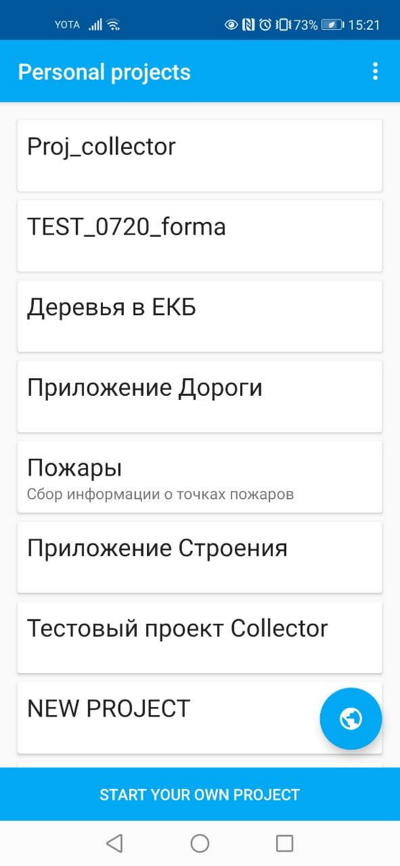

.. sectionauthor:: Roman Gainullov <roman.gainullov@nextgis.com>

.. _ngcol_oper:

Working with projects
=====================

After a successful login, team member data collection will see a list of projects.

You can view project info by taping the tree dots on the right. A pop-up will contain the version of the project and its URL.

.. figure:: _static/project_info_en.png
   :name: project_info_pic
   :align: center
   :width: 8cm

   Viewing project information

Suppose that a data collection project was created in Web GIS with a start page setting in the form of a list.
If you choose this test project NextGIS Collector mobile application displays a list of layers.
You can also switch to map mode.

   Select a project to collect

.. figure:: _static/collector_layers-1.png
   :name: collector_layers-1
   :align: center
   :width: 8cm

   Editable project layers

.. figure:: _static/collector_layers-2.png
   :name: ngc-user-09
   :align: center
   :width: 8cm

   List of Project Layers in Map View

Member data collection team can start editing layers. Editing tools
and approaches are similar to those used in NextGIS Mobile.
