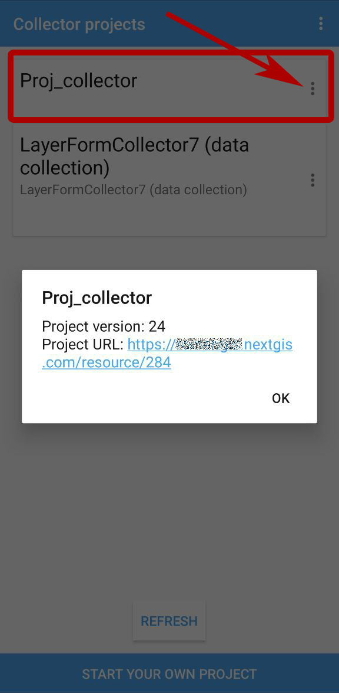
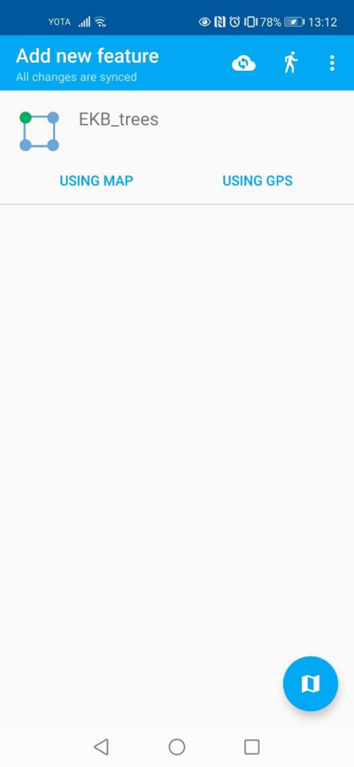
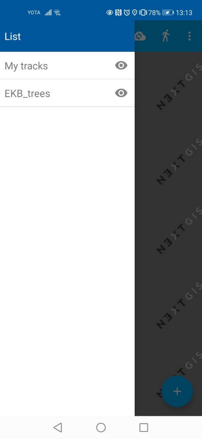

.. sectionauthor:: Roman Gainullov <roman.gainullov@nextgis.com>

.. _ngcol_oper:

Working with projects
=====================

After a successful login, team member data collection will see a list of projects.

You can view project info by taping the tree dots on the right. A pop-up will contain the version of the project and its URL.

   Viewing project information

Suppose that a data collection project was created in Web GIS with a start page setting in the form of a list.
If you choose this test project NextGIS Collector mobile application displays a list of layers.
You can also switch to map mode.

   Editable project layers

   List of Project Layers in Map View

Member data collection team can start editing layers. Editing tools
and approaches are similar to those used in NextGIS Mobile.

.. _ngcol_offline:

Offline data collection
---------------------------------

With NextGIS Collector you can collect data even with no Internet connection. 

**Prepare the device**. Beforehand you need to download the project to your device. While connected to the Internet, log in to the app and select the Collector project.

If you need to see the basemap while adding features, download the basemap tiles. Make sure your area of interest is displayed on the screen. Then tap on the downward arrow next to the basemap layer and select the necessary zoom levels. Basemap tiles will be saved in the app cache.

.. figure:: _static/ngcol_base_cache_en.png
   :name: ngcol_base_cache_pic
   :align: center
   :width: 8cm

   Basemap tile cache

While you **collect data** in the field, the edits are stored locally on your device. 

Then you need to **send the data to the cloud**. Connect to the Internet, then press the synchronization icon |button_sync| on the top tab of the app. The data will be sent to the server.

.. |button_sync| image:: _static/button_sync.png
   :alt: with a cloud
   :width: 9mm

If the connection is lost or other issues occur, you'll get a message about synchronization error. Try again later, when the connection is stabe.

.. important:: Do not exit the project or delete the app, otherwise all the data will be lost. 

If the synchronization is impossible, you can save the collected data to a `ZIP archive <https://docs.nextgis.com/docs_collector/source/adv_tools.html#ngcol-backup>`_ to transfer it another way. 

