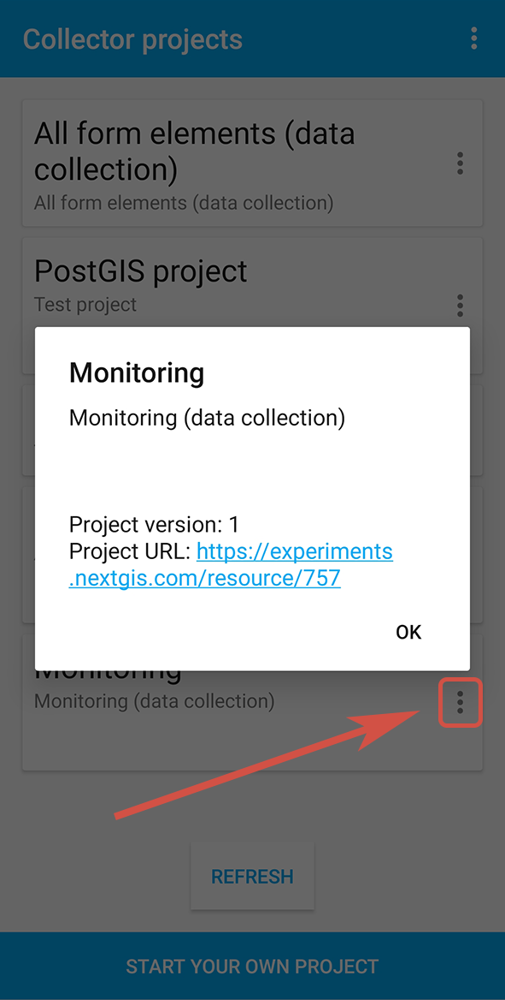
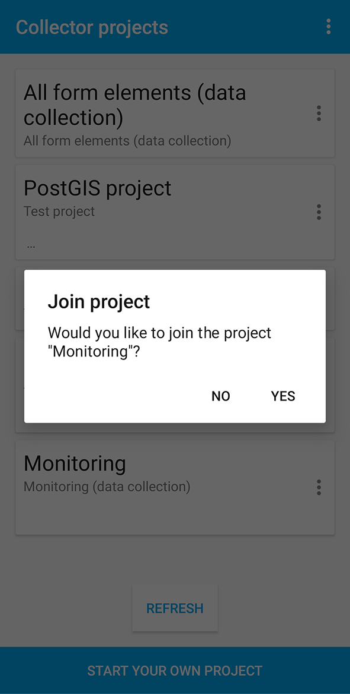
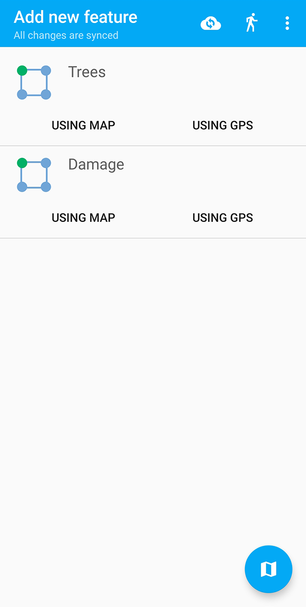
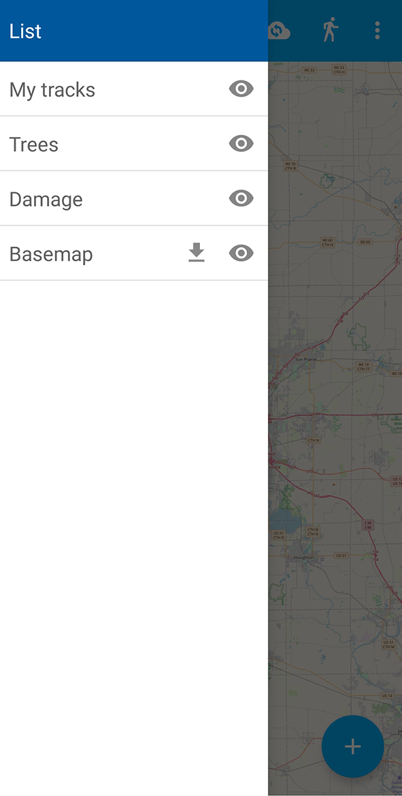
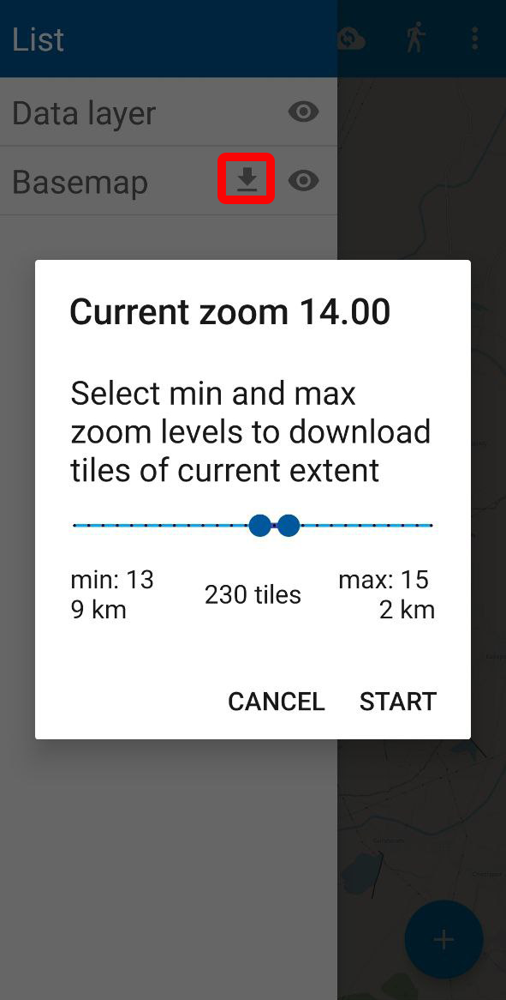

.. _ngcol_oper:

Working with projects
=====================

.. note::
    The full algorithm of data collection is described in `this section <https://docs.nextgis.com/docs_ngcom/source/collector.html>`_ .

After a successful login, data collector will see a list of available projects. You can view project info by taping the tree dots on the right. A pop-up will contain the version of the project and its URL.

   Viewing project information

To join a project tap on its name, then confirm your choice in the pop-up.

   Choose data collection project

There are two types of starting screen for a project. It can be either a map or a list of layers. 

   Editable layers of the project

To switch to the map view, press the |button_map| in the bottom right corner.

.. |button_map| image:: _static/button_map.png
   :width: 8mm

When in map view, press three lines to display the layer tree.

   List of layers in the map mode

Now the collector can start `editing layers <https://docs.nextgis.com/docs_collector/source/map_tools.html>`_.

.. _ngcol_offline:

Offline data collection
---------------------------------

With NextGIS Collector you can collect data even with no Internet connection. 

**Prepare the device**. Beforehand you need to download the project to your device. While connected to the Internet, log in to the app and select the Collector project.

If you need to see the basemap while adding features, download the basemap tiles. Make sure your area of interest is displayed on the screen. Then tap on the downward arrow next to the basemap layer and select the necessary zoom levels. Basemap tiles will be saved in the app cache.

   Basemap tile cache

While you **collect data** in the field, the edits are stored locally on your device. 

Then you need to **send the data to the cloud**. Connect to the Internet, then press the synchronization icon |button_sync| on the top tab of the app. The data will be sent to the server.

.. |button_sync| image:: _static/button_sync.png
   :alt: with a cloud
   :width: 9mm

If the connection is lost or other issues occur, you'll get a message about synchronization error. Try again later, when the connection is stabe.

.. important:: Do not exit the project or delete the app, otherwise all the data will be lost. 

If the synchronization is impossible, you can save the collected data to a `ZIP archive <https://docs.nextgis.com/docs_collector/source/adv_tools.html#ngcol-backup>`_ to transfer it another way. 

