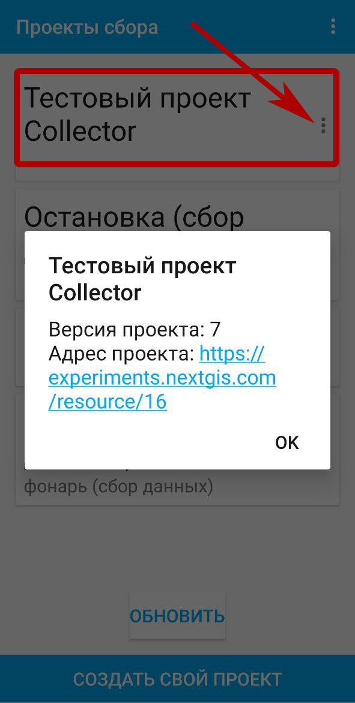
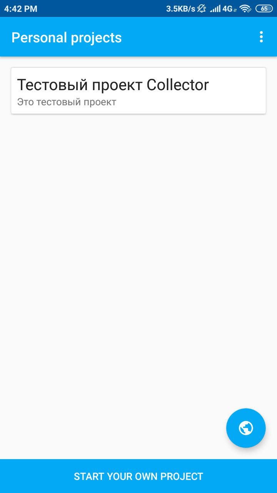
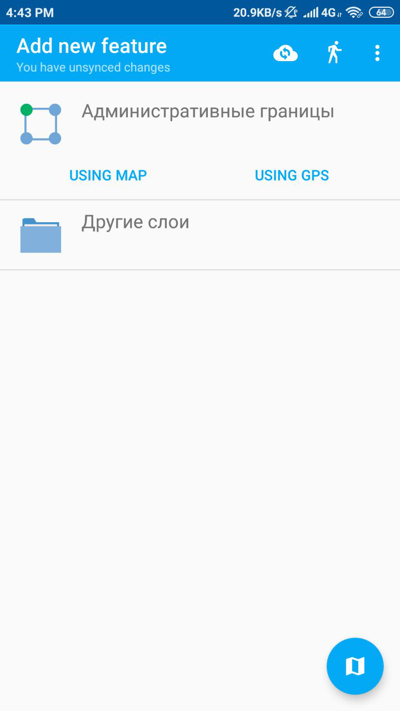
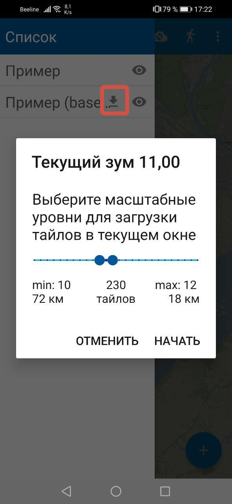

.. sectionauthor:: Роман Гайнуллов <roman.gainullov@nextgis.com>

.. _ngcol_oper:

Работа с проектами
==================

.. note::
    Подробный алгоритм сбора данных описан в `данном <https://docs.nextgis.ru/docs_ngcom/source/collector.html>`_ разделе.

После успешного входа участник команды по сбору данных увидит список проектов. Чтобы увидеть более подробную информацию о проекте, нажмите на три точки справа. Во всплывающем окне будет номер версии проекта и ссылка на размещение проекта в Веб ГИС.

   Информация о проекте

Предположим, что в Веб ГИС был создан проект по сбору данных с настройкой стартовой страницы в виде списка.
При выборе этого тестового проекта мобильное приложение NextGIS Collector отобразит список слоев.
Также можно переключить в режим карты.

   Выберите проект для сбора

   Редактируемые слои проекта

.. figure:: _static/ngc-user-09.png
   :name: ngc-user-09
   :align: center
   :width: 8cm

   Список слоев проекта в режиме просмотра "Карта"

Участник команды сбора данных может начинать редактирование слоев. Инструменты редактирования
и подхода к редактированию аналогичны используемым в NextGIS Mobile.

.. _ngcol_offline:

Сбор данных оффлайн
---------------------------------

Приложение NextGIS Collector позволяет собирать данные даже при отсутствии доступа к интернету. 

**Подготовка**. Предварительно нужно загрузить проект на устройство. Пока доступ к сети ещё есть, авторизуйтесь в приложении и подключитесь к проекту Collector.

Если вы хотите видеть подложку при добавлении объектов на карту, загрузите тайлы подложки. Для этого убедитесь, что нужная область отображается на экране устройства, нажмите на стрелочку вниз рядом со слоем подложки и выберите нужный зум. Тайлы подложки будут сохранены в кэше приложения.

   Кэширование подложки

Во время **сбора данных** изменения будут сохраняться локально на устройстве. 

Затем собранные данные нужно **отправить в облако**. Подключившись к сети, нажмите на значок синхронизации |button_sync| в верхней панели приложения. Данные будут отправлены на сервер.

Если связь потеряна или возникли другие проблемы, вы получите сообщение об ошибке синхронизации. Подождите некоторое время, убедитесь, что подключение к интернету стабильно, и попробуйте синхронизировать ещё раз.

.. important:: Не выходите из проекта и не удаляйте приложение, иначе данные будут потеряны. 

Если по каким-то причинам не удаётся произвести синхронизацию, вы можете сохранить собранные данные `как ZIP-архив <https://docs.nextgis.ru/docs_collector/source/adv_tools.html#ngcol-backup>`_. Это позволит передать их администратору альтернативными способами.

