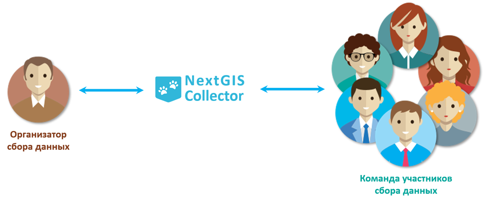

.. _principles:

.. _nextgis.com: http://nextgis.com/
.. _NextGIS Collector: https://play.google.com/store/apps/details?id=com.nextgis.collector

Принципы работы с NextGIS Collector
===================================

NextGIS Collector - технология, которая создана для упрощения сбора пространственных данных на местности.

NextGIS Collector дает возможность владельцу Веб ГИС, созданной на nextgis.com, организовать команду из
нескольких человек и начать сбор данных с помощью мобильных устройств.

NextGIS Collector представляет собой технологический стек, который призван объединить поток данных между
организатором и участниками сбора данных для эффективного контроля за процессом и облегчения сбора данных
(процесс сбора данных описан в предыдущем разделе).

   Место NextGIS Collector среди участников процесса сбора данных

Можно выделить следующие этапы работы, характерные для процесса сбора данных в NextGIS Collector:

1. Организатор сбора регистрируется на nextgis.com_ и создает веб ГИС на тарифном плане `Премиум <http://nextgis.ru/pricing/#premium/>`_.
2. Участники команды сбора данных регистрируются на nextgis.com_.
3. Организатор сбора данных добавляет участников команды сбора данных в свою веб ГИС и создает проект сбора данных.
4. Участники команды устанавливают приложение `NextGIS Collector`_ и подключается к проекту.
5. Участники команды начинают сбор данных. Данные автоматически отправляются в Веб ГИС организатора.

Схематически этапы работы c NextGIS Collector можно представить так:

.. raw:: html

   <iframe width="560" height="315" src="https://www.youtube.com/embed/fal_oUeGiLE"
    frameborder="0" allow="accelerometer;
    autoplay; encrypted-media; gyroscope; picture-in-picture" allowfullscreen></iframe>

Таким образом, для начала сбора данных нужно следующее:

- Организатор сбора данных должен иметь Веб ГИС, которая находится на тарифном плане `Премиум <http://nextgis.ru/pricing/#premium/>`_.
- Каждый участник команды по сбору данных должен иметь при себе мобильный телефон на базе ОС Android.
- Каждый участник команды по сбору данных должен быть зарегистрирован в системе nextgis.com_ и знать свой email и пароль, которые он использовал при регистрации.
