.. _stages:

.. _nextgis.com: http://nextgis.com/
.. _NextGIS Collector: https://play.google.com/store/apps/details?id=com.nextgis.collector

Этапы работы в NextGIS Collector
================================

Организатор сбора данных: добавление участников команды в веб ГИС
-----------------------------------------------------------------

.. important::
    Описываемая в данном разделе функциональность доступна в веб ГИС, созданной сервисе nextgis.com_ и
    находящейся на тарифном плане `Премиум <http://nextgis.ru/pricing/#premium/>`_

Первый этап работы с системой предполагает регистрацию участников команды по
сбору данных в веб ГИС организатора сбора данных. Как было сказано выше,
участники команды по сбору данных должны иметь при себе мобильный телефон на базе ОС Android.
На каждый из телефонов будет установлено мобильное приложение `NextGIS Collector`_ -
оно позволит вносить изменения в данные и синхронизировать эти изменения
с веб ГИС организатора сбора данных.

Кроме того, каждый участник команды по сбору данных должен быть зарегистрирован
на сервисе nextgis.com_. Участник команды может сделать это самостоятельно
и передать организатору сбора данных свой логин. Логин nextgis.com_ - это e-mail,
который участник использовал при регистрации.

После того, как каждый участник команды по сбору данных зарегистрируется в
системе nextgis.com_, организатор сбора данных будет иметь список e-mail
участников команды по сбору данных.

Для добавления участников команды в веб ГИС необходимо выполнить следующие действия:

1. Открыть веб ГИС как администратор системы.

.. important::
    Описанные ниже действия требуют прав администратора

2. Откроется главная страница с ресурсами вашей веб-ГИС. Необходимо открыть «Панель управления»:

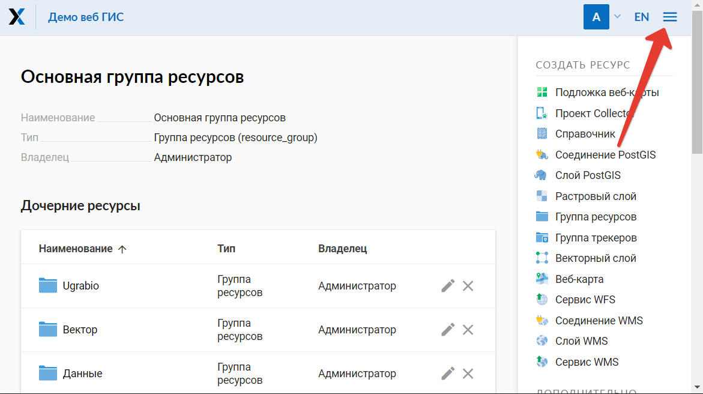

   Открыть панель пользователя

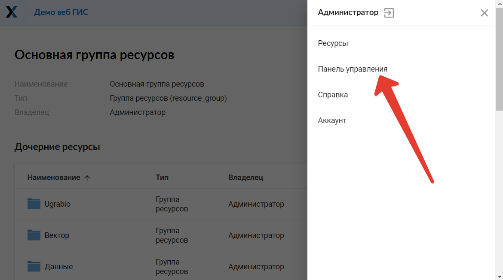

   Выбрать «Панель управления»

3. В секции «Панель управления» необходимо выбрать ссылку «Проекты Collector»:

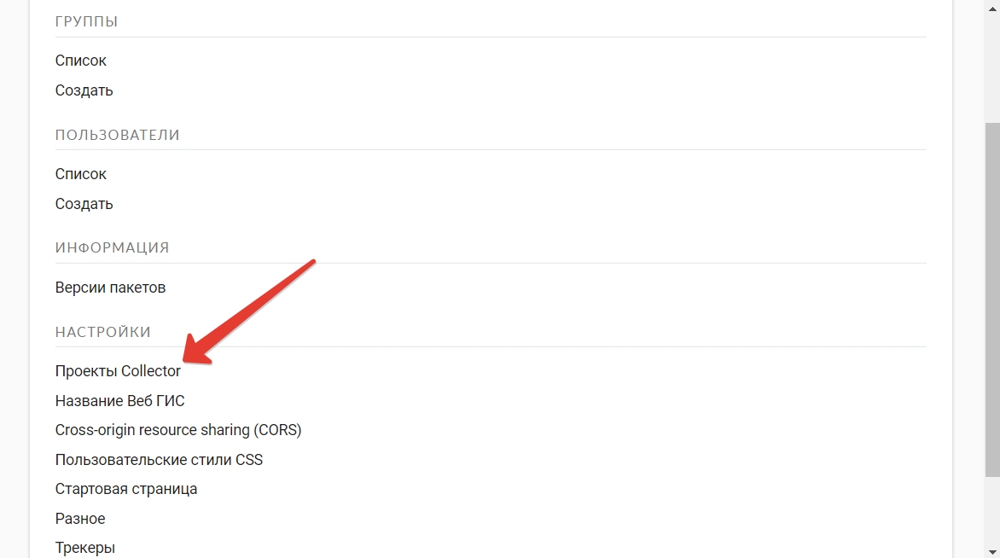

   Выбрать «Проекты Collector»

4. Откроется секция «Настройки NextGIS Collector»:

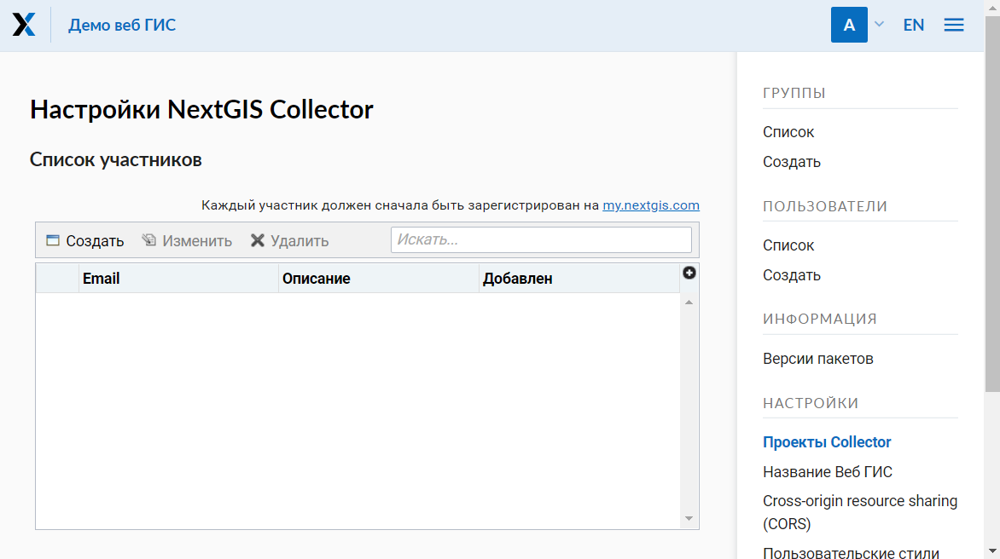

   Общий вид страницы «Настройки NextGIS Collector»

5. Для добавления участника команды по сбору данных в веб ГИС необходимо нажать кнопку «Создать»,
откроется модальное окно «Новый участник». В нем необходимо заполнить необходимые поля.

.. note::
    Рекомендуется заполнять поле «Описание» фамилией и именем участника команды по сбору данных,
    чтобы в дальнейшем иметь данные о пользователях NextGIS Collector в одном месте. В таблице пользователей
    работает поиск, поэтому всегда можно найти участника. Эта особенность становится актуальной при
    большом количестве участников.

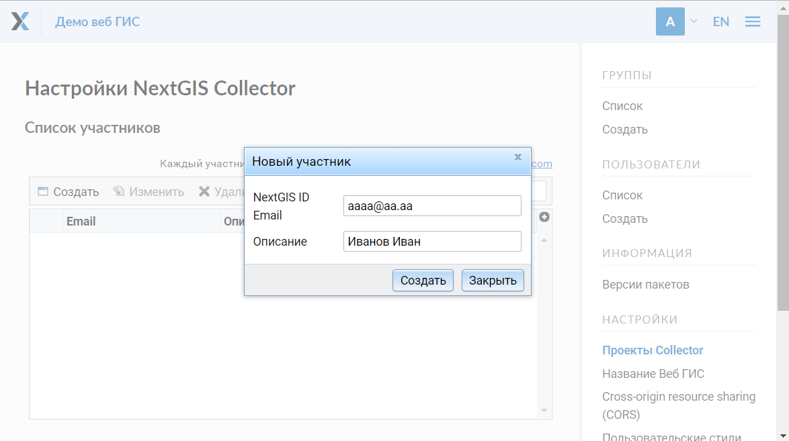

   Добавляем нового участника команды по сбору данных

6. В результате выполнения действий этого этапа в вашей веб ГИС будут зарегистрированы участники
команды по сбору данных.

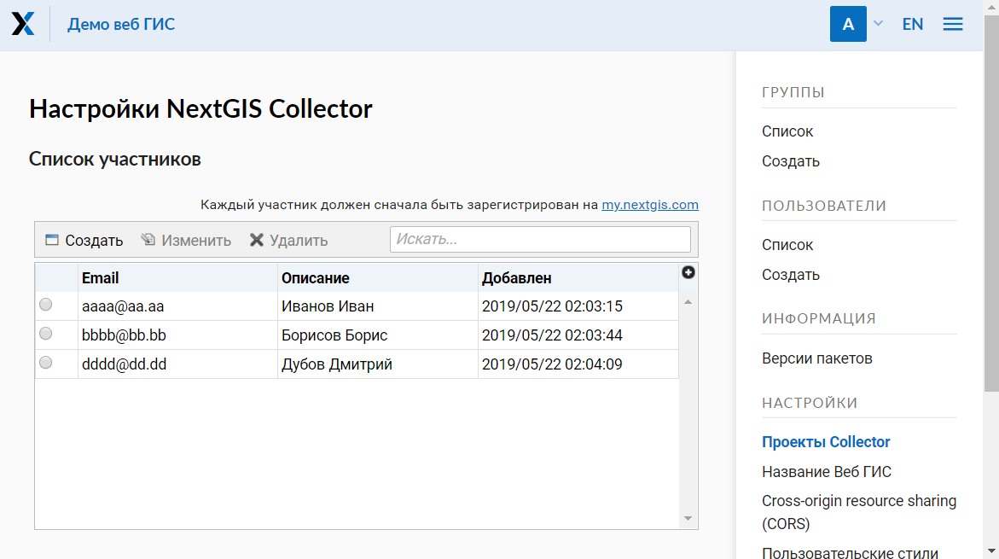

   Пример заполненной таблицы участников команды по сбору данных

Это значит, что пользователи с данными e-mail, смогут при установке
мобильного приложения `NextGIS Collector`_ и успешной авторизации в нем, получить проекты
сбора данных из вашей веб ГИС и начать сбор данных. Однако, в каждом отдельном проекте
вы сможете контролировать доступ различных пользователей. Детальнее, это будет описано ниже.

Организатор сбора данных: создание проекта сбора данных
-------------------------------------------------------

Проект сбора данных - это ресурс в вашей веб ГИС, который представляет собой набор слоев
данных для редактирования. В веб ГИС «проект сбора данных» сокращенно называется «Проект Collector».
Проект сбора данных в дальнейшем загрузит мобильное приложение `NextGIS Collector`_
и предоставляет возможность участнику команды по сбору данных возможность редактировать слои,
содержащиеся в нем. Владелец веб ГИС имеет возможность ограничивать доступ к проекту
отдельным участникам команды по сбору данных.

Предположим, что в нашей веб ГИС уже загружены слои данных и мы хотим создать проект
и предоставить возможность участникам команды по сбору данных собирать или редактировать
уже имеющиеся данные нашей веб ГИС. Для этого необходимо выполнить следующие действия:

1. Открыть веб ГИС.

2. Выбрать в панеле «Создать ресурс» ссылку «Проект Collector»:

.. important::
    Создание проекта сбора данных рекомендуется выполнять администратору веб ГИС.

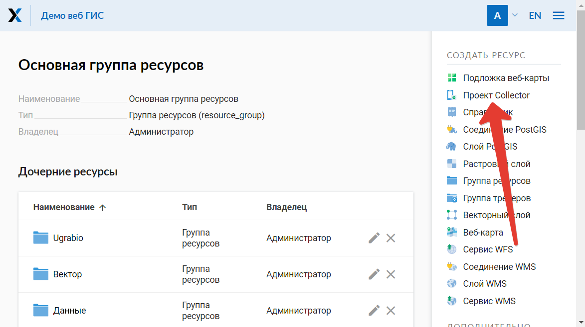

   Выбор пункта создания ресурса «Проект Collector»

3. Ввести наименование проекта. Это наименование будет доступно в мобильном приложении `NextGIS Collector`_:

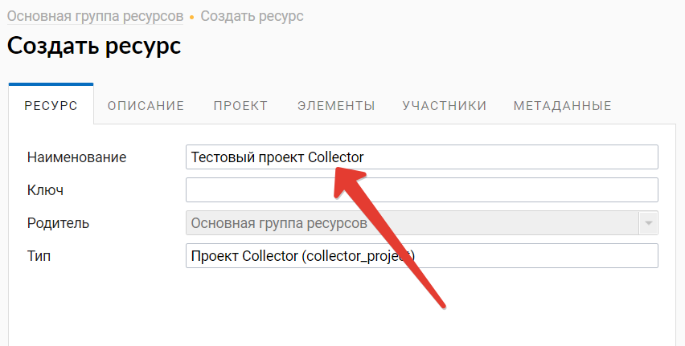

4. Далее необходимо открыть вкладку «Проект» и заполнить поля «Вид начального экрана» и
«Данные для входа NextGIS Collector».

«Вид начального экрана» - опция, которая задает стартовый экран в мобильном приложении `NextGIS Collector`_ -
это может быть либо список слоев, либо карта.

«Данные для входа NextGIS Collector» - это имя и пароль пользователя веб ГИС, под которым мобильное приложение
`NextGIS Collector`_, установленное у всех участников вашей команды по сбору данных, будет вносить изменения
в слои вашей веб ГИС.

.. note::
    Для того, чтобы заполнить «Данные для входа NextGIS Collector» рекомендуется предварительно создать нового
    пользователя, предназначенного именно для мобильного приложения `NextGIS Collector`_. Этому пользователю
    необходимо назначить права чтения и записи данных для тех слоев, которые будут находиться в вашем проекте.
    Тогда вы сможете гибко обеспечивать безопасность ваших данных в процессе сбора данных.

.. important::
    Не рекомендуем использовать для заполнения поля «Данные для входа NextGIS Collector» данные пользователя с
    правами Администратора, т.к. в случае утери или перехвата этих данных злоумышленник может получить
    доступ к вашей веб ГИС.

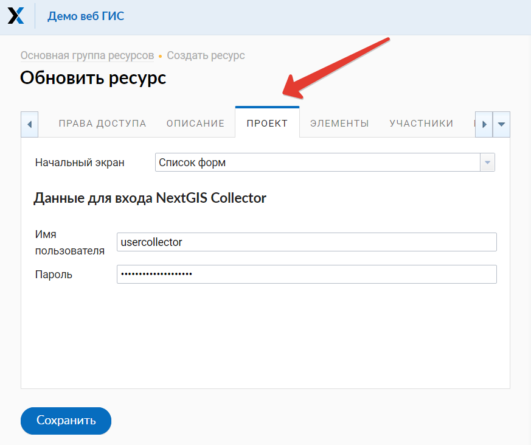

   Внешний вид вкладки «Проект»

5. Следующий этап - добавление необходимых элементов в проект.

Элемент проекта Collector может быть редактируемым слоем данных, слоем данных для только для отображения,
картографической подложкой или формой для сбора данных.

Добавление аналогично добавлению слоев при создании веб-карты - необходимо нажать кнопку «Добавить элемент»
для добавления слоя или формы сбора данных. Кнопка  «Добавить группу» позволяет
создать группу элементов. Внутри дерева элементов работает перетягивание.

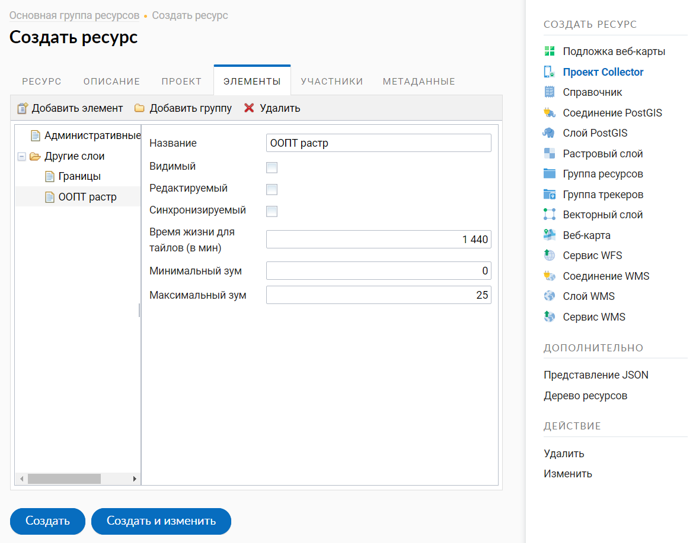

   Внешний вид вкладки «Элементы»

Каждый элемент проекта Collector имеет следующие атрибуты:

- «Название» - название слоя, которое будет доступно в мобильном приложении NextGIS Collector.
- «Видимый» - контролирует видимость слоя в в мобильном приложении NextGIS Collector.
- «Редактируемый» - будет ли пользователь мобильного приложения NextGIS Collector иметь возможность редактирования слоя.
- «Синхронизируемый» - будут ли правки слоя синхронизироваться с вашей веб ГИС.
- «Время жизни» - время кеширования тайлов (актуален для тайловых слоев).
- «Минимальный зум» - минимальный зум на котором будет виден слой.
- «Максимальный зум» - максимальный зум на котором будет виден слой.

6. Далее необходимо предоставить доступ необходимым участникам команды сбора данных. На вкладке «Участники»
путем установления галок выбираем тех участников команды по сбору данных, которые должны участвовать в этом проекте:

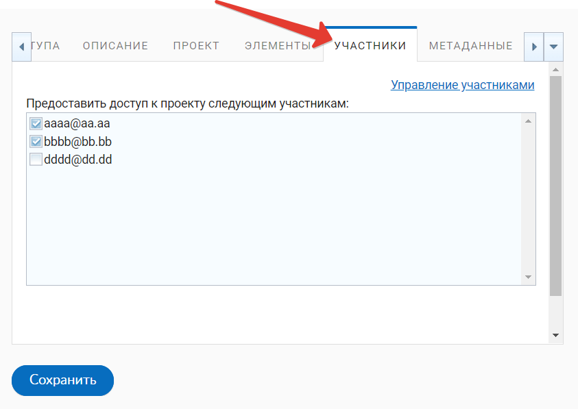

   Внешний вид вкладки «Участники»

7. Сохраняем проект.

В результате осуществления приведенных выше действий будет создан проект Collector (проект по сбору данных).

Таких проектов в вашей веб ГИС может быть неограниченное количество. В каждом из проектов вы можете ограничивать
или разрешать доступ только определенному набору участников из команды участников по сбору данных.
